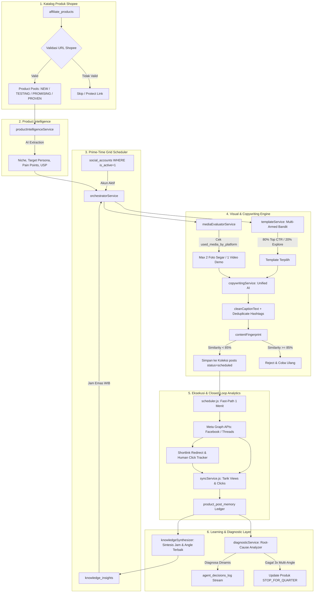

# 🤖 Arsitektur Sistem AI Autonomous Marketing Agent

Dokumentasi komprehensif ini merinci arsitektur lengkap, alur data (*data pipeline*), state machine siklus produk, logika pengambilan keputusan, integrasi multi-platform, serta panduan teknis bagi developer agar pengembangan sistem agen di masa depan tetap stabil, sinkron, dan bebas dari *bug* keterputusan alur (*broken pipeline*).

---

## 📑 Daftar Isi
1. [Filosofi & Ringkasan Eksekutif](#1-filosofi--ringkasan-eksekutif)
2. [Diagram Arsitektur Alur Data (End-to-End Pipeline)](#2-diagram-arsitektur-alur-data-end-to-end-pipeline)
3. [Peta Struktur Berkas & Modul](#3-peta-struktur-berkas--modul)
4. [Deep-Dive 7 Pilar Agen Otonom](#4-deep-dive-7-pilar-agen-otonom)
   - [Pilar 1: Product Intelligence Profiler](#pilar-1-product-intelligence-profiler)
   - [Pilar 2: Kurasi Media & Anti-Reuse Per Platform](#pilar-2-kurasi-media--anti-reuse-per-platform)
   - [Pilar 3: Contextual Multi-Armed Bandit Copywriting](#pilar-3-contextual-multi-armed-bandit-copywriting)
   - [Pilar 4: Semantic Content Fingerprinting](#pilar-4-semantic-content-fingerprinting)
   - [Pilar 5: Dynamic Prime-Time Grid Scheduler](#pilar-5-dynamic-prime-time-grid-scheduler)
   - [Pilar 6: Product Post Memory Ledger & Lifecycle State Machine](#pilar-6-product-post-memory-ledger--lifecycle-state-machine)
   - [Pilar 7: Diagnostic Root-Cause Analyzer & Decision Stream](#pilar-7-diagnostic-root-cause-analyzer--decision-stream)
5. [Aturan Khusus Platform Sosial Media & Status Aktivasi Akun](#5-aturan-khusus-platform-sosial-media--status-aktivasi-akun)
6. [Skema Database & Koleksi Firestore](#6-skema-database--koleksi-firestore)
7. [Background Worker, Throttling & Cron Lifecycle](#7-background-worker-throttling--cron-lifecycle)
8. [Katalog REST API Endpoints](#8-katalog-rest-api-endpoints)
9. [Prinsip Emas Pengembangan & Troubleshooting Developer](#9-prinsip-emas-pengembangan--troubleshooting-developer)

---

## 1. Filosofi & Ringkasan Eksekutif

Sistem **AI Autonomous Marketing Agent** dibangun dengan konsep *Closed-Loop Continuous Learning* (Siklus Pembelajaran Tertutup Tanpa Intervensi Manual). 

Tujuan utama agen adalah:
1. **Mengotomatisasi Penuh (0-Touch Autopilot)**: Memilih produk Shopee dari katalog, menyusun materi visual, meracik copywriting berdasarkan sudut pandang terbukti, menjadwalkan ke jam-jam emas (*Peak Golden Hours*), hingga mempublikasikan ke Facebook dan Threads.
2. **Attribution & Validasi Tautan Ketat**: Setiap postingan menghasilkan *shortlink* unik internal (`/s/:code`) yang diteruskan ke link resmi Shopee Affiliate (`tracking: source, campaign, content`) untuk mendeteksi klik manusia (*human clicks*) secara real-time.
3. **Mencegah Polusi Akun (Anti-Duplicate & Fresh Media)**: Agen menjamin tidak ada foto/video yang dipakai berulang pada platform yang sama, serta menolak teks yang memiliki kemiripan semantik $> 85\%$.
4. **Lifecycle Governance (Quarterly Stop)**: Agen secara proaktif mendiagnosis produk yang berkinerja buruk dan mengistirahatkannya (`STOP_FOR_QUARTER`) agar slot posting dialokasikan ke produk berpotensi tinggi.

---

## 2. Diagram Arsitektur Alur Data (End-to-End Pipeline)



---

## 3. Peta Struktur Berkas & Modul

```text
backend/src/
├── services/
│   ├── agent/
│   │   ├── orchestratorService.js      # Otak orkestrator siklus otonom, alokasi slot dinamis & inventory
│   │   ├── productIntelligenceService.js# Ekstraksi persona, pain points, & USP dari Shopee
│   │   ├── mediaEvaluatorService.js    # Filter media anti-reuse per platform (max 2 foto / 1 video)
│   │   ├── templateService.js          # Pustaka template & Contextual Multi-Armed Bandit (MAB)
│   │   ├── copywritingService.js       # Generator copy berbasis waktu WIB, angle, dan batasan karakter
│   │   ├── contentFingerprint.js       # Kalkulator kemiripan teks (Levenshtein / Jaccard / Cosine)
│   │   ├── productPostMemoryService.js # Buku besar memori postingan (product_post_memory) & skor dekomposisi
│   │   ├── metricsCalculator.js        # Kalkulasi CTR, skor normalisasi, & evaluasi A/B testing
│   │   ├── experimentService.js        # Pengelola eksperimen A/B testing hipotesis
│   │   ├── diagnosticService.js        # Root-cause analyzer (Traffic, Content, Offer, Product)
│   │   ├── decisionLogger.js           # Logger transparansi keputusan AI (agent_decisions_log)
│   │   ├── knowledgeSynthesizer.js     # Pembelajaran pola data menjadi wawasan (knowledge_insights)
│   │   └── aiQueueService.js           # Lapisan wrapper pemanggilan OpenAI/Gemini/Deepseek dengan rate-limiter
│   ├── postAnalytics/
│   │   ├── syncService.js              # Sinkronisasi analitik berkala Meta API & pelacak link
│   │   ├── normalizer.js               # Normalisasi metrik antar platform sosial media
│   │   ├── linkMatcher.js              # Pencocokan link afiliasi dari teks caption
│   │   ├── facebookAnalytics.js        # Adapter Graph API Facebook Page & Reels Insights
│   │   ├── instagramAnalytics.js       # Adapter Graph API Instagram Media & Insights
│   │   └── threadsAnalytics.js         # Adapter Graph API Threads Posts & Engagement
│   ├── threads/
│   │   ├── inbound/inboundService.js   # Pemindai balasan masuk Threads untuk auto-reply kontekstual
│   │   └── outbound/outboundService.js # Pemantau kata kunci tren Threads untuk social listening
│   ├── telegramService.js              # Pengiriman laporan kinerja harian & notifikasi siklus
│   ├── tokenRefreshService.js          # Auto-refresh masa aktif long-lived Meta tokens
│   └── postService.js                  # Eksekutor publikasi postingan ke Facebook/Threads
├── workers/
│   └── scheduler.js                    # Worker tunggal berkala (Cron / Google Apps Script trigger)
└── routes/
    ├── agent-orchestrator.js           # REST API kontrol agen, status kuartal, & log keputusan
    ├── accounts.js                     # CRUD akun sosial media & toggle aktivasi (is_active)
    ├── affiliate.js & redirect.js      # Builder Shopee Affiliate & Shortlink Handler (/s/:code)
    └── affiliate-products.js           # CRUD inventori produk Shopee
```

---

## 4. Deep-Dive 7 Pilar Agen Otonom

### Pilar 1: Product Intelligence Profiler
*File: `backend/src/services/agent/productIntelligenceService.js`*
- **Tujuan**: Menganalisis judul, deskripsi, harga, diskon, rating, dan varian produk dari Shopee.
- **Output JSON Terstruktur**:
  ```json
  {
    "niche": "Gadget & Audio",
    "target_audience": "Mahasiswa & Pekerja Remote",
    "pain_points": ["Kabel headset sering kusut", "Baterai TWS cepat habis"],
    "usp": ["Daya tahan baterai 40 jam", "Fitur Active Noise Cancelling"],
    "price_tier": "Mid-Range",
    "recommended_angles": ["Problem-Agitate-Solution", "Honest Review"]
  }
  ```
- **Caching**: Profil disimpan di field `agent_profile` pada dokumen `affiliate_products`. Jika sudah ada, agen tidak membuang token AI untuk menganalisis ulang.

---

### Pilar 2: Kurasi Media & Anti-Reuse Per Platform
*File: `backend/src/services/agent/mediaEvaluatorService.js`*
- **Aturan Ketat**:
  1. Media yang **sudah pernah diposting pada platform tertentu (misal: Facebook)** disimpan pada `used_media_by_platform.facebook` dan **dilarang dipakai lagi di Facebook** (meskipun berbeda akun Facebook).
  2. Media tersebut **tetap boleh dipakai di platform lain (misal: Threads)** jika belum pernah digunakan di Threads.
  3. Maksimal **1 Video Demo Segar** ATAU Maksimal **2 Foto Produk Bersih** per postingan.
  4. Jika semua media produk sudah habis terpakai pada platform tersebut, agen menolak kurasi (`no_fresh_media: true`) dan memilih produk lain.

---

### Pilar 3: Contextual Multi-Armed Bandit Copywriting
*Files: `backend/src/services/agent/templateService.js` & `backend/src/services/agent/copywritingService.js`*
- **Algoritma Epsilon-Greedy**:
  - **80% Eksploitasi**: Memilih template dengan CTR (*Click-Through Rate*) tertinggi untuk kombinasi `platform + objective`.
  - **20% Eksplorasi**: Memilih template alternatif/baru secara acak untuk mencegah kejenuhan audiens dan menemukan pola baru.
- **Konteks Waktu Indonesia (WIB)**:
  - **Sesi Pagi (07:00–09:00 WIB)**: Bahasa segar, semangat memulai hari / kerja / kuliah.
  - **Sesi Siang (11:30–13:30 WIB)**: Bahasa santai jam istirahat makan siang.
  - **Sesi Malam (19:00–21:30 WIB)**: Bahasa santai waktu rebahan malam / belanja santai.
- **Pembersihan Markdown**:
  - Agen **menghapus seluruh markdown bold asterisks (`**` / `*`)** agar teks tampil natural seperti postingan pengguna asli.
  - Duplikasi hashtag dieliminasi otomatis (`deduplicateHashtags`).

---

### Pilar 4: Semantic Content Fingerprinting
*File: `backend/src/services/agent/contentFingerprint.js`*
- **Tujuan**: Mencegah akun terkena penalti spam dari algoritma Meta akibat teks caption yang terlalu mirip.
- **Mekanisme**:
  - Agen mengambil seluruh postingan 7 hari terakhir pada platform target.
  - Menghitung kemiripan menggunakan kombinasi **Jaccard Token Similarity** dan **Levenshtein Distance**.
  - Jika tingkat kemiripan $\ge 85\%$, draf postingan otomatis ditolak (*rejected*) dan agen mengocok ulang sudut pandang.

---

### Pilar 5: Dynamic Prime-Time Grid Scheduler
*File: `backend/src/services/agent/orchestratorService.js`*
- **Struktur Slot Harian**:
  - 3 Sesi Utama (Pagi, Siang, Malam) dengan 3 Slot per Sesi (Total 9 slot prime-time per hari per akun).
- **Penyesuaian Jam Emas (Learned Golden Peak)**:
  - Jika modul pembelajaran (`knowledgeSynthesizer`) mendeteksi bahwa Sesi Malam memiliki CTR tertinggi, agen secara dinamis mengalokasikan 5 slot padat di sekitar jam emas tersebut (`is_golden_peak: true`).
- **Prioritas Jam Emas**: Pada slot bertanda Jam Emas, agen memprioritaskan produk bertaraf **PROVEN / Pemenang**.

---

### Pilar 6: Product Post Memory Ledger & Lifecycle State Machine
*File: `backend/src/services/agent/productPostMemoryService.js`*
- Setiap postingan yang dibuat dicatat ke koleksi `product_post_memory`.
- **Siklus Hidup Produk (Lifecycle State Machine)**:
  ```text
  [NEW] -> (Diposting 1-2x) -> [TESTING]
                                  │
          ┌───────────────────────┼───────────────────────┐
          ↓ (CTR >= 2.5% & Klik >= 30) ↓ (CTR >= 1.5% & Klik >= 15) ↓ (Gagal 3x Multi-Angle/Plat)
      [PROVEN]                [PROMISING]               [STOPPED]
  (Fokus Skala Jam Emas)   (Diberi Slot Testing Lanjut) (Diistirahatkan Kuartal Ini)
  ```

---

### Pilar 7: Diagnostic Root-Cause Analyzer & Decision Stream
*Files: `backend/src/services/agent/diagnosticService.js` & `backend/src/services/agent/decisionLogger.js`*
- Mendiagnosis produk bermasalah ke dalam 4 kategori akar masalah:
  1. **TRAFFIC_PROBLEM**: Produk baru diuji pada 1 platform dan **masih ada platform aktif lain yang belum diuji** (misal: baru diuji di Facebook, belum diuji di Threads). Tindakan: Uji di platform aktif berikutnya.
  2. **CONTENT_PROBLEM**: Baru diuji 1 sudut pandang/media. Tindakan: Uji sudut pandang berbeda (PAS vs Honest Review vs Promo).
  3. **OFFER_PROBLEM**: Tayangan tinggi ($> 1500$) tapi klik $< 2$. Tindakan: Revisi promo/harga.
  4. **PRODUCT_PROBLEM**: Sudah diuji $\ge 3$ kali melintasi seluruh platform aktif dan berbagai sudut pandang namun tetap tidak menghasilkan klik. Tindakan: `STOP_FOR_QUARTER` (Status produk diubah menjadi STOPPED).

---

## 5. Aturan Khusus Platform Sosial Media & Status Aktivasi Akun

> [!IMPORTANT]
> **ATURAN WAJIB PENGEMBANGAN: SELALU FILTER AKUN AKTIF (`is_active == 1`)**
> Jangan pernah menuliskan array platform statis seperti `['facebook', 'instagram', 'threads']` dalam kode pengambil keputusan. Selalu periksa `social_accounts` yang aktif di database pengguna!

| Platform | Dukungan Link Caption | Batasan Karakter | Perlakuan Autopilot |
| :--- | :--- | :--- | :--- |
| **Facebook Page** | ✅ Ya (Bisa diklik langsung) | Bebas (Rekomendasi 200–600 karakter) | **Target Utama Autopilot**. Mendukung gambar feed, video, dan Facebook Reels. |
| **Threads** | ✅ Ya (Bisa diklik langsung) | **Maksimal 500 karakter** (Sistem memangkas aman di 480 karakter) | **Target Utama Autopilot**. Format ringkas, punchy, 2 bullet point, dan 2-3 hashtag. |
| **Instagram** | ❌ Tidak (Teks caption tidak bisa diklik) | 2200 karakter | **Dikecualikan dari Autopilot Link Caption**. Digunakan untuk posting manual via Post Composer / AI Generator. |
| **Telegram** | ✅ Ya (Bot broadcast & webhook) | 4096 karakter | Digunakan untuk Laporan Kinerja Harian & Notifikasi Eksekusi Agen. |

---

## 6. Skema Database & Koleksi Firestore

### 1. `affiliate_products`
```typescript
interface AffiliateProduct {
  id: string;
  user_id: string;
  title: string;
  price: number;
  original_price?: number;
  discount?: string;
  product_url: string;           // URL Shopee asli bersih
  affiliate_url?: string;        // Link affiliate
  images: string[];
  videos: string[];
  lifecycle_status: 'NEW' | 'TESTING' | 'PROMISING' | 'PROVEN' | 'SCALING' | 'COOLING' | 'STOPPED';
  used_media_by_platform: {
    facebook?: string[];         // URL media yang sudah terpakai di FB
    threads?: string[];          // URL media yang sudah terpakai di Threads
  };
  agent_profile?: {
    niche: string;
    target_audience: string;
    pain_points: string[];
    usp: string[];
    recommended_angles: string[];
  };
  quarterly_summary?: {
    current_quarter: string;     // Contoh: "2026-Q3"
    total_attempts: number;
    total_views: number;
    total_clicks: number;
    avg_ctr_percent: number;
  };
}
```

### 2. `product_post_memory`
```typescript
interface ProductPostMemory {
  id: string;                    // mem_{post_id}
  post_id: string;
  product_id: string;
  user_id: string;
  quarter: string;
  context_at_post: {
    platform: 'facebook' | 'threads';
    account_name: string;
    shortlink_code: string;
    posting_hour: number;
    copy_angle: string;
    template_id: string;
    media_type: 'image' | 'video';
    media_urls: string[];
    content_fingerprint: string;
  };
  raw_metrics: {
    views: number;
    reach: number;
    likes: number;
    comments: number;
    shares: number;
    affiliate_clicks: number;
  };
  published_at: string;
}
```

### 3. `knowledge_insights`
```typescript
interface KnowledgeInsight {
  id: string;                    // ins_peak_hour_facebook, ins_angle_...
  user_id: string;
  platform: string;
  insight_type: 'peak_hour_preference' | 'copy_angle_preference';
  finding: string;
  recommended_action: string;
  data_summary: {
    optimal_hour?: number;
    optimal_session?: 'Pagi' | 'Siang' | 'Malam';
    ctr_percent: number;
    sample_count: number;
  };
  confidence: 'preliminary' | 'medium' | 'high';
}
```

### 4. `agent_decisions_log`
```typescript
interface AgentDecisionLog {
  id: string;
  user_id: string;
  decision_type: 'MEDIA_SELECTION' | 'DIAGNOSTIC_ANALYSIS' | 'QUARTER_LIFECYCLE' | 'EXPERIMENT_EVALUATION' | 'PRODUCT_PROFILING';
  product_id: string;
  summary: string;
  reasoning: string;
  metadata: object;
  created_at: string;
}
```

---

## 7. Background Worker, Throttling & Cron Lifecycle

Worker dijalankan melalui `backend/src/workers/scheduler.js`. Endpoint ini dipanggil setiap menit oleh Google Apps Script atau penyedia Cron eksternal.

```text
[Cron Trigger Setiap 1 Menit] -> GET /api/cron/process-scheduled
                                       │
     ┌─────────────────────────────────┴─────────────────────────────────┐
     ↓ (Setiap Menit)                                                    ↓ (Serverless Throttling via 'scheduler_locks')
Fast-Path Publisher:                                               1. Inbound Threads Scan (Setiap 10m)
Kirim postingan terjadwal                                          2. Autonomous Cycle Scheduler (Setiap 15m)
yang scheduled_at <= now                                           3. Analytics Sync Meta & Shortlinks (Setiap 30m)
                                                                   4. Outbound Social Listening (Setiap 30m)
                                                                   5. Token Auto-Refresh (Setiap 12h)
                                                                   6. Telegram Daily Performance Report (Pukul 08:00 WIB)
```

Untuk menjamin eksekusi aman pada environment serverless (seperti Vercel), semua penanda waktu eksekusi disimpan di dokumen Firestore: `system_state/scheduler_locks`.

---

## 8. Katalog REST API Endpoints

Semua endpoint agen berada di bawah rute `/api/agent-orchestrator` dan mewajibkan autentikasi JWT:

| Method | Endpoint | Fungsi |
| :--- | :--- | :--- |
| `POST` | `/api/agent-orchestrator/cycle/run` | Memicu eksekusi 1 putaran siklus otonom secara instan (`forceRun: true`). |
| `GET` | `/api/agent-orchestrator/quarter/status` | Mengambil status kuartal, total views, clicks, CTR global, dan sebaran pool produk. |
| `GET` | `/api/agent-orchestrator/decisions` | Mengambil riwayat log transparansi keputusan AI (dukungan `?limit=` & `?product_id=`). |
| `DELETE`| `/api/agent-orchestrator/decisions` | Menghapus seluruh log keputusan AI milik pengguna. |
| `GET` | `/api/agent-orchestrator/insights` | Mengambil wawasan aktif hasil pembelajaran knowledge layer. |
| `GET` | `/api/agent-orchestrator/memory/product/:id` | Mengambil riwayat lengkap buku besar memori postingan produk tertentu. |
| `POST` | `/api/agent-orchestrator/product/:id/diagnose`| Menjalankan evaluasi diagnosa manual pada produk tertentu. |
| `POST` | `/api/agent-orchestrator/product/:id/override-status` | Mengubah status lifecycle produk secara manual (`NEW`, `TESTING`, `STOPPED`, dll). |
| `GET` | `/api/agent-orchestrator/config` | Mengambil konfigurasi agen (status autopilot, kuota harian). |
| `POST` | `/api/agent-orchestrator/config` | Memperbarui konfigurasi agen. |

---

## 9. Prinsip Emas Pengembangan & Troubleshooting Developer

Untuk mencegah *bug* regresi, putusnya saluran data, atau perilaku tak terduga di masa mendatang, ikuti aturan emas berikut:

### 1. Jangan Pernah Asumsikan Platform Tersedia (No Hardcoded Platforms)
- ❌ **SALAH**: `const platforms = ['facebook', 'instagram', 'threads'];`
- ✅ **BENAR**: Selalu ambil dari database:
  ```javascript
  const accountsSnap = await db.collection('social_accounts')
    .where('user_id', '==', userId)
    .where('is_active', 'in', [1, true, '1'])
    .get();
  const activePlatforms = Array.from(new Set(
    accountsSnap.docs.map(d => d.data().platform).filter(p => ['facebook', 'threads'].includes(p))
  ));
  ```

### 2. Validasi Tautan Sebelum Menjadwalkan
- Jangan pernah menjadwalkan produk yang `product_url` atau `affiliate_url`-nya kosong atau tidak mengandung ID Shopee yang valid (`cleanShopeeProductUrl` / `getValidShopeeProductUrl`).

### 3. Jaga Batas Karakter Threads API
- Meta Threads API membatasi teks maksimal 500 karakter. Pastikan draf caption Threads selalu dipangkas aman pada maksimal 480 karakter dengan mempertahankan link pendek CTA di bagian akhir.

### 4. Jangan Matikan Loop Tertutup (Closed-Loop Sync)
- Ketika postingan dipublikasikan, simpan ID postingan platform (`post_id_on_platform`) ke dalam target array postingan agar saat `syncService` berjalan, data analitik dari Meta API dapat dipetakan kembali ke ID produk yang tepat di `product_post_memory`.

---
*Dokumentasi ini dibuat dan disinkronkan untuk repositori `medsos Agent`.*
